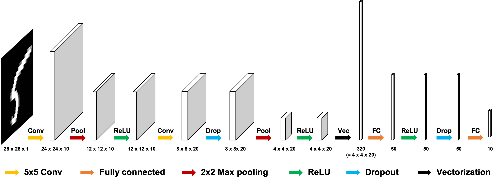

# MNIST Classifier

### Tutorial
[MNIST Classifier Implenmentation](https://github.com/hanyoseob/pytorch-mnist)

### Abstract
This is a **tutorial of MNIST Classification using CNN**.

## Train
    $ python main.py --mode train \
                     --scope [scope name] \
                     --name_data [data name] \
                     --dir_data [data directory] \
                     --dir_log [log directory] \
                     --dir_checkpoint [checkpoint directory]
                     --gpu_ids [gpu id; '-1': no gpu, '0, 1, ..., N-1': gpus]
 ---
* Set **[scope name]** uniquely.
* To understand hierarchy of directories based on their arguments, see **directories structure** below. 
* Hyperparameters were written to **arg.txt** under the **[log directory]**.

## Test
    $ python main.py --mode test \
                     --scope [scope name] \
                     --name_data [data name] \
                     --dir_data [data directory] \
                     --dir_log [log directory] \
                     --dir_checkpoint [checkpoint directory] \
                     --dir_result [result directory]
                     --gpu_ids [gpu id; '-1': no gpu, '0, 1, ..., N-1': gpus]

* To test using trained network, set **[scope name]** defined in the **train** phase.

## Tensorboard
    $ tensorboard --logdir [log directory]/[scope name]/[data name] \
                  --port [(optional) 4 digit port number]
---
    $ tensorboard --logdir ./log/dcgan/celeba \
                  --port 6006
                  
After the above comment executes, go **http://localhost:6006**

* You can change **[(optional) 4 digit port number]**.
* Default 4 digit port number is **6006**.

## Results
* Below table shows quantitative metrics such as cross entropy loss and accuracy. 

|        Metrics     | CNN   |
|:------------------:|:---------:|
| Cross Entropy Loss | 0.0443    |
| Accuracy (%)       | 98.5870   |

